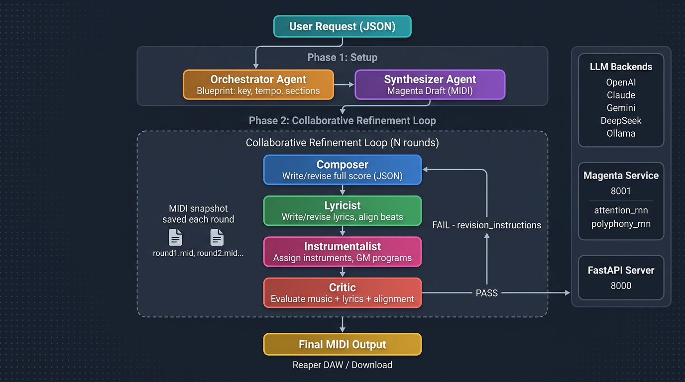

# 白皮书：基于本地多智能体架构的交互式音乐共创系统
**(White Paper: Interactive Music Co-Creation System Based on Local Multi-Agent Architecture)**

## 1. 项目概述 (Project Overview)
本项目旨在开发一款高度安全的本地化人工智能音乐辅助系统。与市面上生成不可编辑音频文件（如MP3）的"黑盒"AI工具不同，本系统被定位为**音乐人的智能副驾驶（Co-pilot）**。它能够接受用户的详细文本指令（如通过JSON格式输入的曲风、情感、指定乐器等），利用多智能体（Multi-Agent）系统进行内部推理与协作，最终在专业数字音频工作站（DAW）中直接生成可逐音符编辑的MIDI轨道与工程文件。

该系统特别强调**跨文化音乐融合**，不仅支持标准的西方乐器，还针对东方传统乐器（如古筝、二胡等）的特殊演奏技法进行了底层架构支持。

---

## 2. 核心设计原则 (Core Design Principles)
1. **完全本地化与数据安全**：系统的"大脑"（LLM及多智能体框架）在本地设备上离线运行，确保用户的创作灵感与数据隐私。
2. **深度可修改性（Deep Modifiability）**：生成内容为原生的DAW工程元素（MIDI音符、自动化曲线），允许音乐人进行二次创作。
3. **传统算法与大模型的结合**：利用LLM作为"逻辑控制层"，调用 Google Magenta 神经网络模型生成乐谱草稿，再由 Agent 进行精细迭代。

---

## 3. 系统架构设计 (System Architecture)



### 3.1 技术栈决策

| 组件 | 选型 | 说明 |
| :--- | :--- | :--- |
| **多智能体框架** | **AutoGen v0.7.5 (agentchat)** | 使用 `BaseChatAgent` + 结构化直调管线（Structured Direct-Call Pipeline）进行编排 |
| **音乐生成引擎** | **Google Magenta** (attention_rnn + polyphony_rnn) | 独立 conda 环境 (Python 3.7) + FastAPI 微服务，端口 8001 |
| **音乐引擎抽象层** | 可插拔接口 | Magenta 已被 Google 归档 (2026.01)，设计抽象接口以便未来替换为 MIDI-LLM / MusicLang 等 |
| **LLM 后端** | Ollama (本地) + OpenAI + Claude + DeepSeek + Gemini | 支持多种 API 后端，通过统一接口切换 |
| **后台服务** | FastAPI + Uvicorn | 主服务运行在端口 8000 |
| **DAW 集成** | Reaper + ReaImGui + ReaScript API | ReaImGui 通过 ReaPack 安装 |
| **符号音乐处理** | music21 + mido | 乐谱分析、MIDI 读写、后处理（弯音/滑音注入） |

### 3.2 前后端分离架构
* **后台引擎 (The Brain)**：基于 FastAPI，运行 AutoGen 多智能体框架 + Magenta 微服务。
* **用户界面 (The Face)**：嵌入在 Reaper DAW 内部的图形交互界面（基于 ReaImGui 构建）。

### 3.3 宿主集成与 UI 交互
* **平台选择**：Reaper (利用 ReaScript API 进行深度控制)。
* **ReaImGui 安装**：通过 ReaPack (https://reapack.com/) → Extensions → Browse packages → 搜索 "ReaImGui" 安装。
* **原生交互界面**：DAW 内悬浮的原生聊天/控制面板，支持文本输入、进度汇报与结果预览。
* **执行层反馈**：用户确认后，后台通过 Python 服务器向 Reaper 发送指令，自动创建轨道、加载 VST 插件并绘制 MIDI。

---

## 4. 多智能体协作流：两阶段架构 (Multi-Agent Pipeline)

### 核心思想
Magenta 提供初始素材，但核心价值来自 **四个 Agent 的协同迭代**——每一轮中，Composer、Lyricist、Instrumentalist、Critic 同时工作，音乐与歌词共同演进，而非先写完曲再填词。

### 阶段一：初始化（Setup）

```
用户请求 (JSON: 曲风/情感/乐器/段落结构)
       │
       ▼
┌─────────────────┐
│   Orchestrator   │  → 解析需求，生成 Composition Blueprint
└───────┬─────────┘    (调性、BPM、拍号、段落结构、乐器建议)
        │
        ▼
┌─────────────────┐
│   Synthesizer    │  → 调用 Magenta 微服务 (端口 8001)
└───────┬─────────┘    生成旋律/和声草稿 (Draft Score)
        │
        ▼
  Draft Score (round0_magenta.mid)
  ├── 具体的 MIDI 音符序列
  ├── 转化为 Score.to_llm_description() 文本摘要
  └── 作为后续协作循环的初始参考
```

### 阶段二：协作精修循环（Collaborative Refinement Loop）

这是系统的核心。每一轮 (round) 中四个 Agent 依次工作，Critic 的反馈同时传递给所有创作 Agent：

```
        ┌─────────────────────────────────────────────────┐
        │          Collaborative Refinement Loop           │
        │           (max_refinement_rounds 轮)             │
        │                                                  │
        │  ┌──────────┐   Blueprint + Draft + Feedback     │
        │  │ Composer  │ → 编写/修改完整乐谱 (JSON)         │
        │  └────┬─────┘   保存 MIDI 快照 (roundN.mid)      │
        │       │                                          │
        │       ▼                                          │
        │  ┌──────────┐   Score + Feedback                 │
        │  │ Lyricist  │ → 编写/修改歌词，对齐音符节拍      │
        │  └────┬─────┘                                    │
        │       │                                          │
        │       ▼                                          │
        │  ┌───────────────┐  Score + Tracks               │
        │  │Instrumentalist│ → 分配乐器、MIDI通道、GM音色   │
        │  └────┬──────────┘                               │
        │       │                                          │
        │       ▼                                          │
        │  ┌──────────┐   Score + Lyrics + Instrumentation │
        │  │  Critic   │ → 综合评审音乐+歌词+配器+对齐     │
        │  └────┬─────┘                                    │
        │       │                                          │
        │   passes?                                        │
        │   ├── YES → 退出循环                              │
        │   └── NO  → revision_instructions 传回所有 Agent  │
        │            进入下一轮                              │
        └─────────────────────────────────────────────────┘
               │
               ▼
      Final Score → 合并最新歌词 + 乐器映射
               │
               ▼
        MIDI 输出 → Reaper DAW / 下载
```

### 关键设计决策

**为什么不是线性流水线（先写曲→再填词→最后配器）？**

好的音乐创作中，旋律、歌词、配器是相互影响的：
- 歌词的音节数影响旋律的节奏密度
- 配器的编排影响和声走向
- Critic 需要看到完整作品才能给出有意义的反馈

因此每一轮都让四个 Agent 协同工作，Critic 的反馈同时指导 Composer（"副歌音符太少"）、Lyricist（"歌词与旋律节拍不对齐"）和 Instrumentalist（"缺少低音声部"）。

### 每轮产出

每一轮 Composer 完成后，系统保存一个 MIDI 快照到 `output/drafts/`：
- `{title}_round0_magenta.mid` — Magenta 原始草稿
- `{title}_round1.mid` — 第 1 轮 Composer 输出
- `{title}_round2.mid` — 第 2 轮 Composer 输出
- ...
- `{title}_{timestamp}.mid` — 最终成品

这允许用户对比每一轮的变化，听到音乐逐步成型的过程。

### 灵感重置机制 (Inspiration Reset)

当迭代精修阶段中 Agent 遇到以下情况时，可触发 Magenta 重新生成：
1. **Critic 连续 N 轮打分低于阈值** — 说明当前草稿基础太差，微调无法挽救
2. **Composer 主动判断"乐句走向不合理"** — 需要神经网络提供新的音乐思路
3. **用户在 DAW UI 中点击"换一批灵感"按钮** — 手动触发

触发后的操作：
- 可请求 Magenta 基于**不同 primer notes** 或**不同 temperature** 生成多个变体
- Agent 对多个变体进行评分、选择最佳片段、合并到当前乐谱中
- 不是推倒重来，而是"局部替换"或"嫁接"

---

## 5. Agent 定义 (AutoGen BaseChatAgent)

| Agent | 职责 | 管线角色 |
| :--- | :--- | :--- |
| **Orchestrator** | 解析用户需求，生成 Composition Blueprint，统筹全局 | Phase 1: 初始化阶段调用一次 |
| **Synthesizer** | 调用 Magenta API、解析 MIDI 输出、转化为 Score 格式 | Phase 1: 生成初始草稿 |
| **Composer** | 和弦进行设计、旋律微调、音符级编辑 | Phase 2: 每轮协作循环 |
| **Lyricist** | 歌词创作、音节-节拍对齐（中文逐字对齐） | Phase 2: 每轮协作循环 |
| **Instrumentalist** | 配器分配、GM 音色映射、MIDI 通道、pan/velocity | Phase 2: 每轮协作循环 |
| **Critic** | 综合评审音乐+歌词+配器+对齐，打分，给出修改指令 | Phase 2: 每轮协作循环，决定 pass/fail |

### 每轮信息流

```
Critic Feedback (上一轮)
    ├── → Composer:  "副歌音符不够密集，bass line 缺失"
    ├── → Lyricist:  "歌词 start_beat 与旋律不对齐"
    └── → Instrumentalist: "缺少 pad 声部，pan 分布太窄"
```

Critic 的 `revision_instructions` 是多目标的，同时指导所有创作 Agent。

---

## 6. 跨文化音源支持
* 支持第三方 **VST 插件** 对接。
* 针对东方乐器（古筝、二胡、琵琶、笛子），通过后处理脚本注入 **Pitch Bend（弯音轮）** 和 **Expression（CC11）** 控制信息。
* Instrumentalist Agent 内置东方乐器演奏技法知识库（揉弦、滑音、轮指、刮奏等）。

---

## 7. Magenta 引擎部署

### 环境隔离
```bash
conda create -n magenta_env python=3.7
conda activate magenta_env
pip install magenta fastapi uvicorn
```

### 预训练模型
- `attention_rnn.mag` — 单声部旋律生成
- `polyphony_rnn.mag` — 多声部和声生成
- 存放于 `./models/` 目录

### 微服务接口
运行于独立进程，端口 8001，提供 REST API：
- `POST /generate_melody` — 旋律生成
- `POST /generate_polyphony` — 多声部生成
- 输入：primer_notes, num_steps, temperature, qpm
- 输出：MIDI 文件路径 + 解析后的 NoteSequence JSON

### 抽象接口设计
Magenta 通过 `MusicEngineInterface` 抽象类封装，未来可替换为：
- **MIDI-LLM** (Llama 3.2 1B, 文本→多轨 MIDI)
- **MusicLang** (CPU 可运行, pip install 即用)
- **text2midi** (T5 + Transformer, 文本描述→MIDI)

---

## 8. LLM 多后端支持

系统支持以下 LLM 后端，通过统一接口切换：

| 后端 | 用途 | 协议 |
| :--- | :--- | :--- |
| **Ollama** | 本地离线推理 | Ollama REST API |
| **OpenAI** | GPT-4o / GPT-4 | OpenAI API |
| **Claude** | Claude 3.5/3.7 | Anthropic API |
| **DeepSeek** | DeepSeek-V3 | OpenAI 兼容 API |
| **Gemini** | Gemini Pro | Google AI API |

AutoGen v0.7.5 自带 `ChatCompletionClient` 支持 OpenAI 协议，可直接复用。

---

## 9. 项目开发时间表 (Timeline & Phases)

| 阶段 | 任务描述 | 预计用时 |
| :--- | :--- | :--- |
| **阶段一：AutoGen 重构** | 将现有 Agent 层重构为 AutoGen BaseChatAgent + 结构化直调管线 | 2 - 3 周 |
| **阶段二：Magenta 引擎集成** | 部署 Magenta 微服务，实现 MusicEngineInterface 抽象层，打通 Agent↔Magenta 调用 | 2 - 3 周 |
| **阶段三：多 LLM 后端** | 实现 Ollama/OpenAI/Claude/DeepSeek/Gemini 统一接口 | 1 - 2 周 |
| **阶段四：协作管线闭环** | 实现完整的 初始化→协作精修循环（Composer+Lyricist+Instrumentalist+Critic）流程 | 3 - 4 周 |
| **阶段五：DAW 深度打通** | 使用 ReaImGui 构建内嵌 UI，打通 HTTP 通信，实现自动化 MIDI 绘制 | 4 - 5 周 |
| **阶段六：音源映射与打磨** | 完善东西方乐器 VST 自动加载与表情控制，全流程调试 | 2 - 4 周 |

**总预计周期：14 - 21 周 (约 3.5 - 5 个月)**

---

## 10. 项目文件结构

```
Music_Generator/
├── autogen/                   # AutoGen v0.7.5 源码（已克隆）
├── config/
│   └── settings.py            # 全局配置
├── models/                    # Magenta 预训练模型 (.mag 文件)
├── src/
│   ├── agents/                # AutoGen BaseChatAgent 实现
│   │   ├── orchestrator.py
│   │   ├── composer.py
│   │   ├── lyricist.py
│   │   ├── instrumentalist.py
│   │   ├── critic.py
│   │   ├── synthesizer.py     # Magenta 桥接 Agent
│   │   └── pipeline.py        # 结构化协作管线编排
│   ├── music/
│   │   ├── models.py          # 音乐数据模型
│   │   ├── theory.py          # 音乐理论工具
│   │   ├── score.py           # 乐谱表示与操作（Agent 直接编辑的核心数据结构）
│   │   └── midi_writer.py     # MIDI 输出
│   ├── engine/
│   │   ├── interface.py       # MusicEngineInterface 抽象类
│   │   ├── magenta_engine.py  # Magenta 实现
│   │   └── magenta_service.py # Magenta 微服务（独立进程运行）
│   ├── llm/
│   │   ├── client.py          # 多后端 LLM 统一客户端
│   │   └── prompts.py         # Agent 系统提示词
│   ├── api/
│   │   ├── schemas.py
│   │   └── routes.py
│   ├── daw/
│   │   └── reaper.py          # Reaper DAW 集成
│   └── main.py
├── output/                    # 生成的 MIDI 文件
│   └── drafts/                # 每轮快照 MIDI (roundN.mid)
├── requirements.txt
└── Project.md
```
